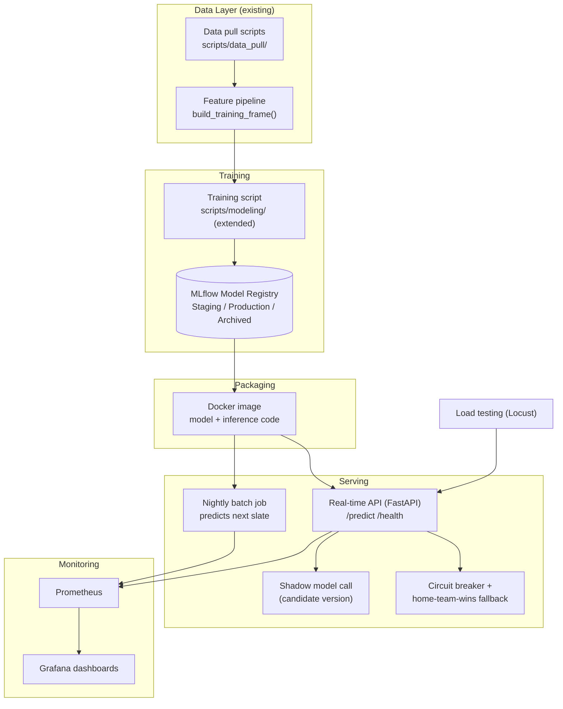
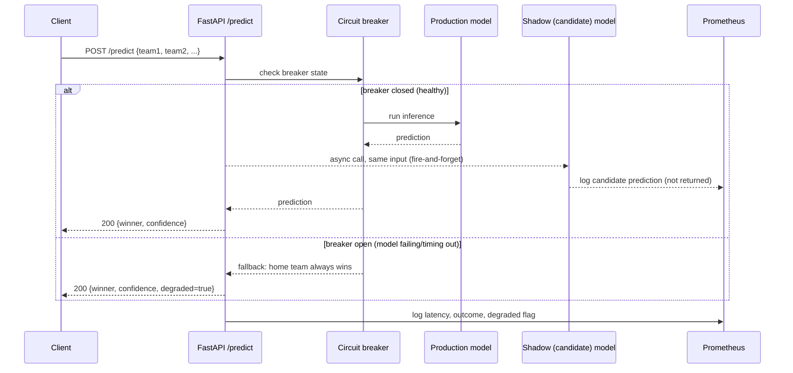
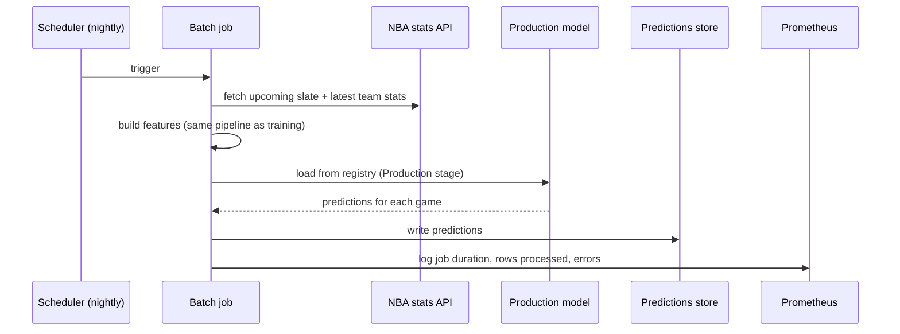

# Architecture: from data science to a production ML system

This document plans the path from the current pipeline (API pulls → CSV merges → one training script → a pickle file) to a ML system: the model actually running in production, containerized, served both in real time and in batch, versioned, monitored, and reliable under failure.

**Scope note:** this doc only plans the _serving/production_ layer. It does not
propose new modeling features or fix the residual monthly-stats leakage
described in `log.md` — that's a separate, orthogonal modeling-quality
concern.

## 1. Current state vs. target state

**Current** (see `README.md` for the full pipeline):

- `scripts/data_pull/` hits the NBA stats API and writes CSVs to `NBAdata/`.
- `scripts/data_prep/merge_advanced_base_stats.py` builds monthly team-stat tables.
- `scripts/modeling/decision_tree_training.py` builds the training frame, cross-validates
  6 classifiers, and `joblib.dump`s the winner to `NBAdata/best_model.pkl` / `scaler.pkl`.
- Nothing after that. No API, no container, no scheduled job, no registry, no
  dashboard. Getting a prediction means running the script by hand and reading
  a pickle in a notebook.

**Target:** (batch first — the nightly job is the priority; the on-demand
real-time API is deferred to the last build phase, see §9)

- The trained model is packaged into a Docker image and served two ways:
  an on-demand real-time API, and a nightly batch job that predicts the next
  slate of games.
- Every training run is logged to a model registry; promoting a model to
  production is a deliberate stage transition, not overwriting a `.pkl` file.
- The API degrades gracefully (circuit breaker → heuristic fallback) instead
  of failing a caller when the model service has a problem.
- New model versions are validated in shadow before they take live traffic.
- Latency, throughput, error rate, accuracy-over-time, and feature drift are
  all visible on a dashboard, not just "did the script print something
  reasonable."
- The API's capacity is known from load testing, not assumed.

## 2. Component diagram



## 3. Request flows

### Real-time on-demand prediction



### Nightly batch predictions



## 4. Reliability patterns

**Circuit breaker + fallback.** The real-time API wraps every model-inference
call in a breaker. After N consecutive failures or timeouts past a threshold,
the breaker opens and the API serves the "home team always wins" heuristic
instead of erroring — this is exactly the baseline `decision_tree_training.py`
already computes (`X["Team1Home"] == y`); in production it becomes the actual
fallback strategy, not just an evaluation number. The breaker half-opens after
a cool-down to test if the model service has recovered.

**Shadow deployment.** When a new model version is a promotion candidate, it
runs on the same live traffic as the current production model, but its output
is only logged, never returned to the caller. Once enough shadow predictions
have accumulated (and, over time, enough games have completed), the candidate
is compared against the production model on accuracy and agreement rate. Only
then does it get promoted to Production in the registry.

## 5. Metrics

| Template concept           | This project                                                                                                       |
| -------------------------- | ------------------------------------------------------------------------------------------------------------------ |
| Click-through rate         | Rolling prediction accuracy vs. actual game outcomes (updated once a game finishes)                                |
| Latency percentiles        | p50/p95/p99 on `/predict`                                                                                          |
| Throughput                 | Requests/sec, especially under load test                                                                           |
| Reliability                | Error rate, circuit-breaker trip frequency                                                                         |
| Feature distribution shift | Live inbound feature stats (`Team1_W_PCT`, `PIE`, `eFG%`, `TOV%`, `ORB%`, `FTR`) vs. the training-set distribution |
| (new, not in template)     | Shadow-vs-production agreement rate                                                                                |

## 6. Proposed repo layout (directories only — not created by this doc)

```
NBA_Prediction/
  scripts/data_pull/        # existing
  scripts/data_prep/        # existing
  scripts/modeling/         # existing, extended to log to MLflow
  serving/
    api/                    # FastAPI app: main.py, circuit_breaker.py, shadow.py
    batch/                  # nightly batch job
    inference/              # shared model-loading code (registry client)
  docker/                   # Dockerfile.api, Dockerfile.batch, docker-compose.yml
  monitoring/                # prometheus.yml, grafana dashboards
  load_testing/              # locustfile.py
```

## 7. Versioning strategy

- **Models:** MLflow Model Registry. Each training run logs params, metrics,
  and the model artifact; promotion is an explicit stage transition
  (`None → Staging → Production → Archived`), so "what's live" is always a
  queryable fact, not "whatever `best_model.pkl` currently contains."
- **Data:** DVC tracking the `NBAdata/` training snapshot, so a given model
  version can be traced back to the exact data it was trained on.
- **Code:** git, already in place.

## 8. Tooling choices

- **Plain FastAPI + Docker**, with no dedicated ML-serving framework on top.  
  A trained model this size doesn't need one; the API and Dockerfile are  
  simple enough to own directly. If the serving surface grows later (more  
  traffic, more model variants), scale by running more replicas of the same  
  container behind a load balancer — or a lightweight orchestrator like  
  Kubernetes if that becomes necessary — rather than adopting a new  
  packaging/serving abstraction on top of what's already working.
- **MLflow** for the registry — runs locally with minimal setup, which fits a
  single-developer project better than a hosted registry.
- **Prometheus + Grafana** for monitoring — the standard pairing, and
  Prometheus client libraries drop into FastAPI with a few lines.
- **Locust** for load testing — Python-native, fits the rest of the stack.

## 9. Phased build order

Batch is the priority; the on-demand real-time API is deferred to the end of
this list.

1. Package the existing `best_model.pkl`/`scaler.pkl` into a Docker image and
   build the nightly batch job (same feature pipeline, predicts the next
   slate of games, writes results to a predictions store). Get batch working
   end to end first.
2. Introduce MLflow (training script logs runs) and DVC (data snapshots), and
   point the batch job at the registry's Production model instead of a local
   pickle.
3. Add Prometheus instrumentation for the batch job (job duration, rows
   processed, errors) + a Grafana dashboard, including feature drift
   tracking.
4. Build the real-time FastAPI service (`/predict`, `/health`) on top of the
   same Docker-packaged model.
5. Add the circuit breaker + heuristic fallback to the real-time API.
6. Add shadow deployment support (run a candidate model alongside
   production, on real-time and/or batch predictions).
7. Add Locust load tests against the real-time API; tune based on results.
8. (Optional) CI/CD to build/push the Docker image and run tests on merge.

Each phase is independently useful and shippable — this isn't an all-or-nothing
rebuild.

## 10. Explicit non-goals

- Does not fix the residual monthly-stats leakage noted in `log.md`
  ("Known limitations") — that's a modeling-quality issue, independent of
  this serving architecture.
- Does not add player-level features (injuries, rest days) — also modeling
  scope, not architecture scope.
- Does not commit to a specific cloud provider or orchestrator (Kubernetes,
  ECS, etc.) — out of scope until there's a reason to need one beyond a single
  container.
